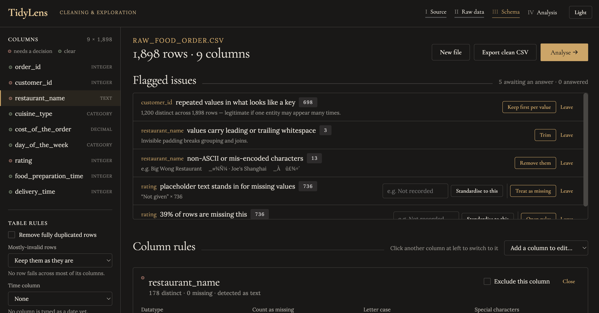
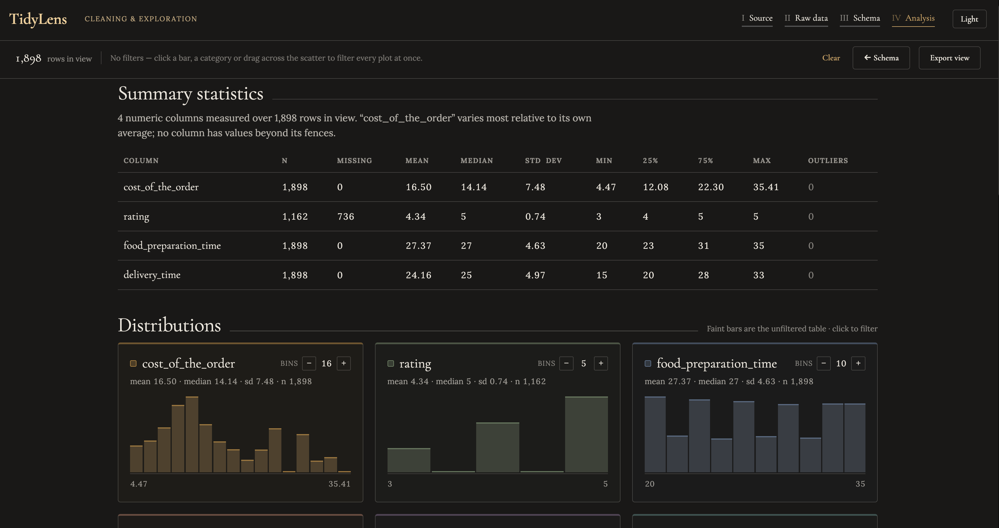

# TidyLens
A browser-based tool for cleaning datasets and running a first pass of exploratory analysis. Drop in a CSV or Excel file, define the rules each column should follow, export the cleaned data, then explore it with linked charts. Nothing is uploaded anywhere.

Try it -> 

## Motivation and Goal

Most of the work with an unfamiliar dataset happens before any analysis: figuring out what each column is supposed to contain, catching the values that don't belong, standardizing dates and text, and only then looking at distributions. That pass is usually done ad hoc in a notebook and thrown away.

TidyLens makes it explicit and repeatable. You declare what each column should look like, the tool enforces it, and you get a cleaned file out the other end alongside the analysis.

It also runs entirely client-side, which matters because the datasets most worth cleaning are usually the ones you can't paste into a website.

## Cleaning
* Schema validation against the types you assign
* Per-column data types, set through a dropdown rather than inferred and hoped for
* Allow and disallow lists so a column only accepts values from a defined set
* Date handling with explicit format selection for time columns
* String cleaning covering special characters and encoding, trailing whitespace, and case standardization
* Inconsistency flagging that surfaces problems it can't resolve on its own and asks how to handle them
* Export of the cleaned dataset

## Analysis

* Summary statistics per column: mean, median, standard deviation
* Histograms showing distribution
* Scatter plots of any two columns, with optional fitted trendline
* Correlation calculations across numeric columns
* Outlier identification
* Filters synced across every chart, so narrowing one view narrows all of them
* Hover to inspect individual data points

## Privacy
The file never leaves your machine. Parsing, cleaning, and chart rendering all happen client-side. There is no backend and no upload step. You can verify this by opening the browser network tab while loading a file.

## Running locally

git clone https://github.com/jhashw/tidylens.git
cd tidylens
open index.html

Single self-contained HTML file. No build step, nothing to install.. A sample dataset is bundled in for users to try it without their own file. 

## Built with

## Built with

Built with Claude Design. I wrote the specification, and iterated on the
behaviour and interface through it. The requirements spec is in
[SPEC.md](SPEC.md).

React 18 for the UI. There are no third-party data or charting libraries; the analytical work is all in-file:

- CSV and TSV parsing
- XLSX reading, which walks the zip central directory directly and inflates entries with the browser's native DecompressionStream
- Charts rendered as raw SVG
- Statistics computed in-browser: Pearson correlation, histogram binning, and outlier detection with selectable rules (IQR × 1.5,
  IQR × 3.0, or z-score > 3)

The result is a single self-contained HTML file with no build step,
no bundler, and no network requests.
